# DISA STIG Scan — Azure Windows 11 VM
**Cyber Range Lab | February 2026**

---

## Overview

This lab documents the process of deploying a Windows 11 Pro VM on Microsoft Azure and running a full DISA STIG compliance scan using Tenable Vulnerability Management. The goal is to identify security misconfigurations on a baseline Windows 11 build and understand what hardening is required to meet DoD STIG standards.

---

## Table of Contents

1. [Azure VM Setup](#azure-vm-setup)
2. [Scan Results Summary](#scan-results-summary)
3. [High Severity Findings](#high-severity-findings-cat-i)
4. [Medium Severity Findings](#medium-severity-findings)
5. [DISA STIG Audit Failures](#disa-stig-audit-failures)
6. [Lessons Learned](#lessons-learned)
7. [Screenshots](#screenshots)

---

## Azure VM Setup

### VM Configuration

- **OS:** Windows 11 Pro
- **Generation:** V2 (UEFI)
- **Architecture:** x64
- **Hibernation:** Disabled
- **Computer name:** Set relevant to purpose (e.g., `vm-win11-stig-s`)

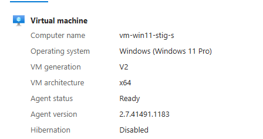

### Step 1 — Create Azure Virtual Network (VNet)

**Via Azure Portal:**

Navigate to Virtual Networks > Create, configure the address space and subnet.

**Via Azure CLI:**

```bash
az network vnet create \
  --name MyVNet \
  --resource-group MyResourceGroup \
  --address-prefix 10.1.0.0/16

az network vnet subnet create \
  --name MySubnet \
  --resource-group MyResourceGroup \
  --vnet-name MyVNet \
  --address-prefixes 10.1.0.0/24
```


### Step 2 — Deploy the VM and Connect

- Attach VM to the VNet/subnet created above
- Enable logging during provisioning
- Connection options: **Azure Bastion** or **Native RDP** (download `.rdp` file)

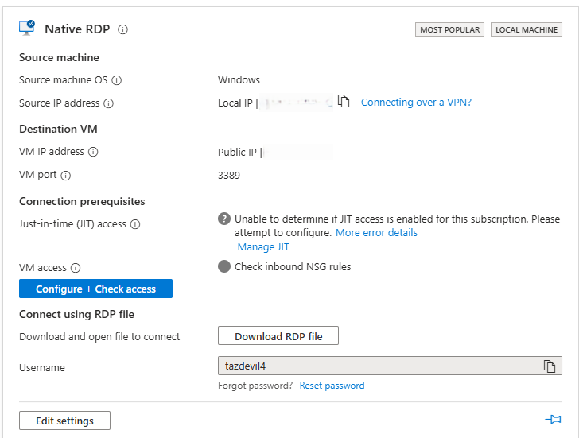

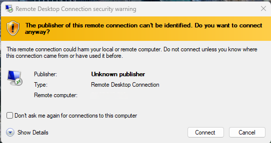

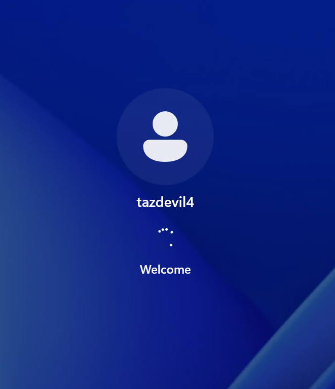

### Step 3 — Disable Windows Defender Firewall (Intentional Misconfiguration)

> **Note:** The following steps were applied to create a deliberately misconfigured baseline for the STIG scan. These settings intentionally violate STIG requirements.

Open the firewall settings via `Win+R` → `wf.msc`, or use PowerShell:

```powershell
Set-NetFirewallProfile -Profile Domain,Private,Public -Enabled False
```

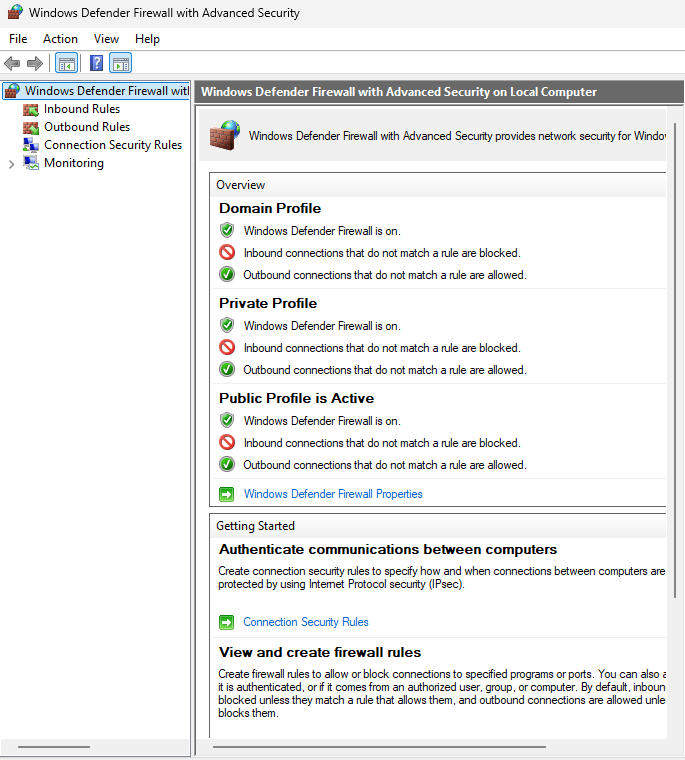

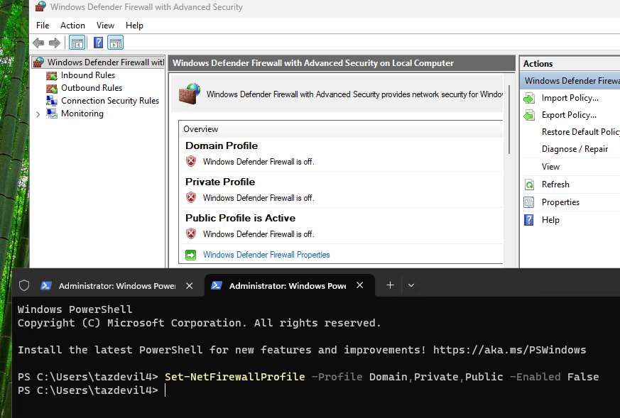

### Step 4 — Account Configuration via Computer Management

**Administrator account:**

- Enable the built-in `Administrator` account
- Set a blank password with no expiration
- Add to the Administrators group

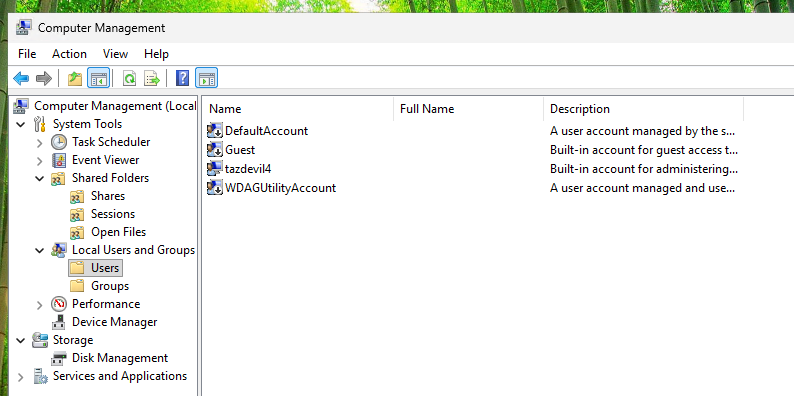

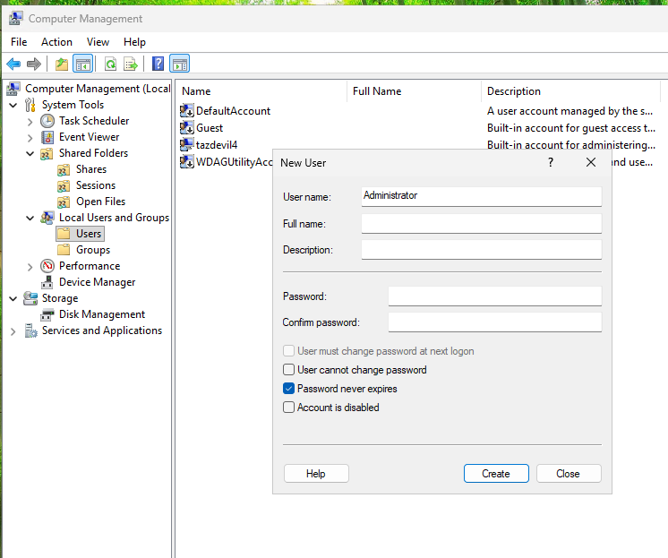

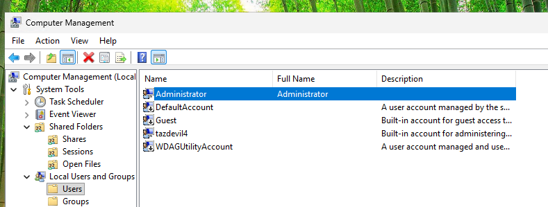

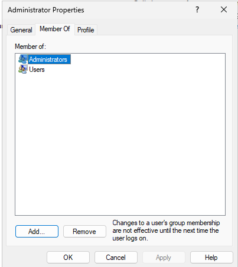

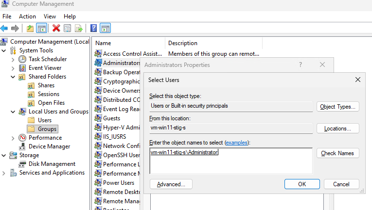

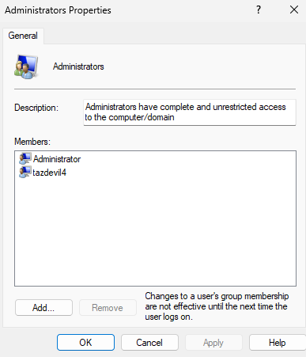

**Guest account:**

- Enable the `Guest` account
- Set a blank password with no expiration
- Add to the Administrators group

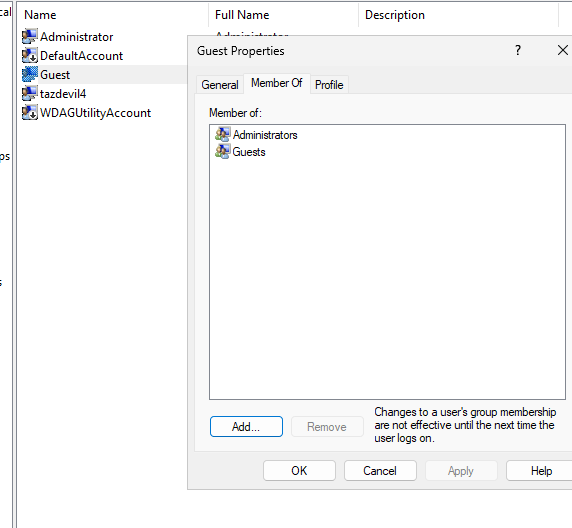

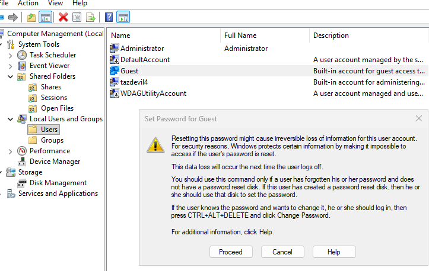

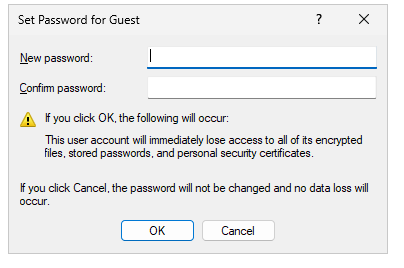

---

## Scan Results Summary

**Target Host:** `vm-win11-stig-s`
**OS:** Microsoft Windows 11 Pro 25H2 (Build 26200.7840)
**Scan Start:** 2026-02-17 23:03 UTC | **Scan End:** 2026-02-18 00:05 UTC
**Scanner:** Tenable Vulnerability Management
**STIG Benchmark:** DISA_STIG_Microsoft_Windows_11_v2r5

| Severity | Count |
|----------|-------|
| Critical | 0 |
| High | 3 |
| Medium | 2 |
| Low | 2 |
| Info | 124 |
| **Total** | **131** |

---

## High Severity Findings (CAT I)

### 1. Outlook for Windows — Missing Security Update (CVE-2024-20670)

- **CVSS v3:** 8.1 (AV:N/AC:L/PR:N/UI:R/S:U/C:H/I:H/A:N)
- **Plugin:** 193266 | **IAVA:** 2024-A-0225-S
- **Installed:** `1.0.0.0` | **Fixed:** `1.2023.0322.0100`
- **Risk:** Missing KB5002574 allows attackers to steal Net-NTLMv2 hashes via malicious emails for relay attacks.

### 2. Microsoft Teams — Remote Code Execution (CVE-2025-53783)

- **CVSS v3:** 7.5 (AV:N/AC:H/PR:N/UI:R/S:U/C:H/I:H/A:H) | **VPR:** 6.7
- **Plugin:** 250276 | **IAVA:** 2025-A-0600
- **Installed:** `1.0.0.0` | **Fixed:** `25122.1415.3698.6812`
- **Risk:** Heap-based buffer overflow in Teams stub allows remote code execution over the network.

### 3. WinVerifyTrust Signature Validation (CVE-2013-3900)

- **Plugin:** 166555
- **Risk Factor:** High
- **Risk:** `EnableCertPaddingCheck` not applied — allows signed malware to bypass Windows signature validation.

---

## Medium Severity Findings

### 4. SSL Self-Signed Certificate — RDP (Port 3389)

- **CVSS v3:** 6.5 | **Plugin:** 57582
- RDP presents an untrusted self-signed cert (`CN=vm-win11-stig-s`). Enables man-in-the-middle attacks.

### 5. SSL Certificate Cannot Be Trusted — RDP (Port 3389)

- **CVSS v3:** 6.5 | **Plugin:** 51192
- Certificate not signed by a recognized CA. TLSv1.0 and TLSv1.1 also still enabled (deprecated).

---

## Low Severity Findings

### 6. ICMP Timestamp Disclosure (CVE-1999-0524)

- **CVSS:** 2.1 | **Plugin:** 10114
- System responds to ICMP timestamp requests, leaking system time for fingerprinting.

### 7. Microsoft Teams — Elevation of Privilege (CVE-2025-49731)

- **CVSS v3:** 3.1 | **VPR:** 2.2 | **Plugin:** 264898
- Installed: `1.0.0.0` | Fixed: `25163.3611.3774.6315`

---

## DISA STIG Audit Failures

### Encryption & Boot Security

| STIG ID | Cat | Finding | Required |
|---------|-----|---------|----------|
| WN11-00-000031 | I | BitLocker NOT configured — no pre-boot PIN | TPM + PIN required |
| WN11-00-000032 | II | BitLocker PIN minimum not set | 6+ digits |
| WN11-00-000020 | II | Secure Boot DISABLED in UEFI firmware | Must be enabled |
| WN11-CC-000070 | II | Virtualization-Based Security not enforced | VBS + Secure Boot required |

> Both C: and D: drives: **0% encrypted, Protection Off**

### Account & Password Policy

| STIG ID | Cat | Current Value | Required |
|---------|-----|--------------|----------|
| WN11-AC-000035 | II | Min password length: **0** | 14 characters |
| WN11-AC-000020 | II | Password history: **0** | 24 remembered |
| WN11-AC-000040 | II | Complexity: **Disabled** | Enabled |
| WN11-AC-000030 | II | Min password age: **0 days** | 1+ days |
| WN11-AC-000010 | II | Lockout threshold: **10** | 3 or fewer |
| WN11-AC-000015 | II | Lockout reset counter: **10 min** | 15 min |
| WN11-AC-000005 | II | Lockout duration: **10 min** | 15 min |
| WN11-00-000090 | II | Admin & Guest: **password never expires** | Must expire |

### System Hardening

| STIG ID | Cat | Finding |
|---------|-----|---------|
| WN11-00-000150 | I | **SEHOP disabled** — no heap overflow protection |
| WN11-00-000155 | II | **PowerShell v2 not disabled** — logging/AMSI bypass risk |
| WN11-00-000175 | II | Secondary Logon service set to **Manual** (should be Disabled) |
| WN11-00-000135 | II | Host-based firewall: **NULL on all profiles** (Domain, Private, Public) |
| WN11-CC-000039 | II | "Run as different user" available in context menus |
| WN11-CC-000210 | II | Microsoft Defender SmartScreen not enforced |

### Audit Policy Failures

All of the following were set to **"No Auditing"**:

- `WN11-AU-000005` — Credential Validation (Failure) | CAT II
- `WN11-AU-000010` — Credential Validation (Success) | CAT II
- `WN11-AU-000035` — User Account Management (Failure) | CAT II
- `WN11-AU-000045` — PNP Activity (Success) | CAT II
- `WN11-AU-000050` — Process Creation (Success) | CAT II
- `WN11-AU-000054` — Account Lockout (Failure) | CAT II
- `WN11-AU-000060` — Group Membership (Success) | CAT II
- `WN11-AU-000081` through `WN11-AU-000589` — Object Access, Privilege Use, File System, Registry, Handle Manipulation | CAT II

### PKI / Certificates

| STIG ID | Cat | Finding |
|---------|-----|---------|
| WN11-PK-000005 | II | DoD Root CA certificates NOT in Trusted Root Store |
| WN11-PK-000020 | II | US DOD CCEB cross-certificates NOT in Untrusted Store |

---

## Host System Details

| Property | Value |
|----------|-------|
| Hostname | vm-win11-stig-s |
| OS | Windows 11 Pro 25H2 (Build 26200.7840) |
| BIOS | Hyper-V UEFI Release v4.1 — **Secure Boot: DISABLED** |
| Architecture | x64 |
| Memory | 3578 MB |
| BitLocker C: | Not encrypted (0%, Protection Off) |
| BitLocker D: | Not encrypted (0%, Protection Off) |
| Windows Defender | Installed, Engine 1.1.26010.1 |
| Teams Version | 1.0.0.0 (outdated stub) |
| Credential Guard | NOT fully enabled |
| Open RDP Port | TCP/3389 |

**Local Accounts:**

| Account | Status |
|---------|--------|
| tazdevil4 | Admin group, last logged on |
| Administrator | Admin group, **password never expires** |
| Guest | Active, **password never expires** |
| DefaultAccount | Disabled |
| WDAGUtilityAccount | Disabled |

---

## Lessons Learned

### 1. Encrypt Before You Deploy
BitLocker and Secure Boot must be baseline requirements. A VM without encryption is fully exposed to offline data theft. Build a pre-deployment checklist that validates both before any machine goes live.

### 2. Default Password Policies Are Not Secure
Windows out-of-the-box does not enforce STIG-compliant password policies. Apply a hardening GPO or PowerShell script immediately after provisioning, before any accounts are created.

### 3. Disable Built-in Accounts Immediately
The `Guest` and `Administrator` accounts are high-value targets. Leaving Guest active with no password expiration is an open invitation for attackers. These should be addressed in the first minutes after OS installation.

### 4. No Auditing = No Forensic Visibility
With every audit policy set to "No Auditing," there are zero logs to investigate after an incident. Auditing must be treated as non-negotiable infrastructure. Enable the full STIG audit policy set from day one.

### 5. The Firewall Was Completely Off
With RDP open on port 3389 and no firewall on any profile, the machine was fully reachable. Never disable the Windows Firewall without a compensating control. Create explicit rules for needed ports instead of turning the firewall off.

### 6. Application Stubs Create Real Vulnerabilities
Teams and Outlook stub packages (`1.0.0.0`) in WindowsApps were flagged for CVSS 7.5 and 8.1 CVEs including an RCE. Audit installed packages after deployment and remove or update stubs.

### 7. PowerShell v2 Is a Security Bypass
PS v2 has no script block logging, no AMSI, and no constrained language mode. Always run:
```powershell
Disable-WindowsOptionalFeature -Online -FeatureName MicrosoftWindowsPowerShellV2Root
```

### 8. Enable SEHOP and Credential Guard
Both are free built-in Windows mitigations that only require configuration. SEHOP blocks heap/stack overflow exploits. Credential Guard prevents NTLM hash extraction from LSASS — a core pass-the-hash technique.

### 9. RDP Self-Signed Certs Enable MitM Attacks
Self-signed certs cannot be validated by clients. Deploy a cert from a trusted internal CA for RDP and disable TLS 1.0/1.1 via Group Policy.

### 10. Lab VMs Get the Same Hardening as Production
Lab VMs routinely get promoted to production or connected to real infrastructure. Build a hardened gold image with STIG controls pre-applied and clone from it instead of starting from a raw Windows ISO.

### Priority Remediation Plan

| Priority | Action |
|----------|--------|
| 1 | Enable BitLocker on C: and D:, re-enable Secure Boot in UEFI |
| 2 | Apply STIG-compliant password/lockout GPO immediately post-build |
| 3 | Enable all DISA-required audit policies; forward logs to SIEM |
| 4 | Enable Windows Firewall on all profiles with explicit allow rules |
| 5 | Apply Windows updates and remove/update all application stubs |

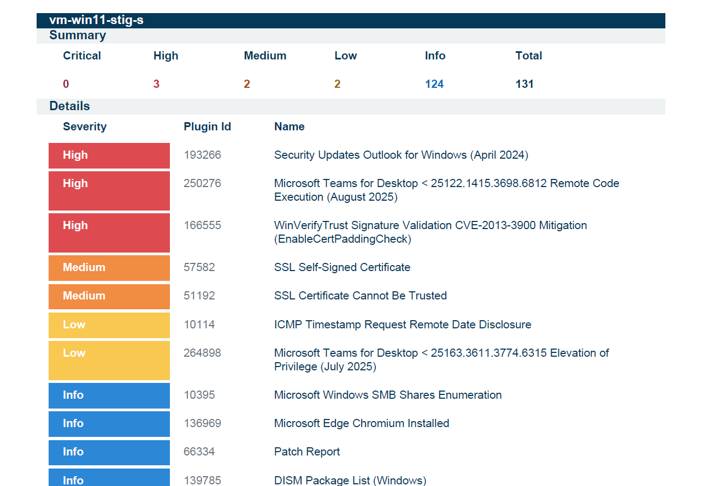

---

## Screenshots

All 17 screenshots are embedded in the [Azure VM Setup](#azure-vm-setup) section above and stored in the [`screenshots/`](screenshots/) folder.

| File | Description |
|------|-------------|
| image1.png | VM creation — name, OS, generation, architecture |
| image2.png | VNet and subnet configuration |
| image3.png | VM deployed — Bastion / RDP connect options |
| image4.png | Downloading and opening the RDP file |
| image5.png | RDP connection in progress |
| image6.png | Opening wf.msc to disable the firewall |
| image7.png | Firewall disabled — all profiles turn red |
| image8.png | Computer Management — enabling Administrator account |
| image9.png | Creating Administrator with blank password |
| image10.png | Adding Administrator to Administrators group |
| image11.png | Administrator Properties — Member Of tab |
| image12.png | Administrators group — confirming membership |
| image13.png | Administrator account membership confirmed |
| image14.png | Guest account — password never expires, added to Administrators |
| image15.png | Setting blank password on Guest account |
| image16.png | Confirming Guest account blank password |
| image17.png | Overall takeaway and remediation summary |

---

## Files in This Directory

| File | Description |
|------|-------------|
| `Disa-Scan-Win-11-Fred_Scan1.pdf` | Full Tenable DISA STIG scan report (PDF) |
| `Azure-vm-stig-scan.docx` | Lab documentation and scan write-up (Word) |
| `screenshots/` | 17 PNG screenshots from the lab |

---

*Lab conducted in a controlled cyber range environment. All findings are on a deliberately misconfigured VM for training purposes.*
